# 后台管理案例

案例效果：

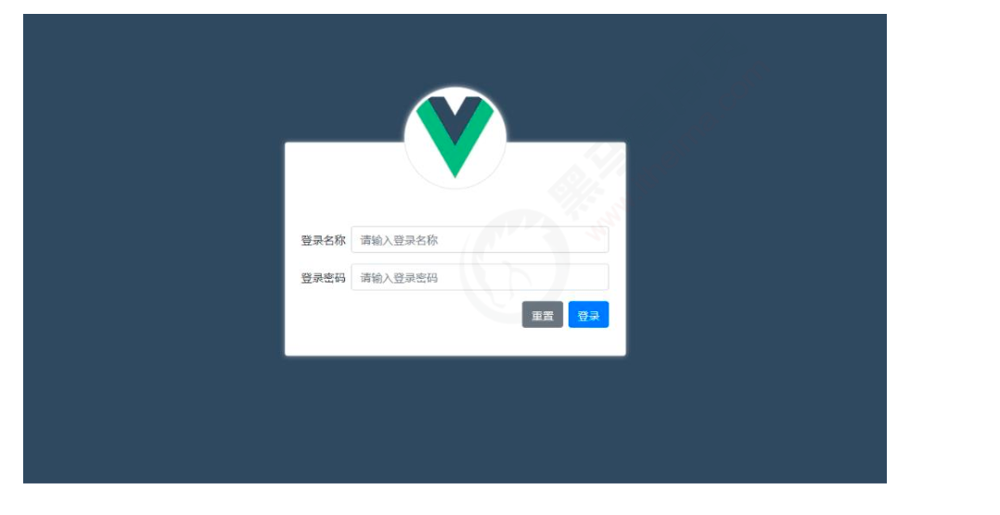

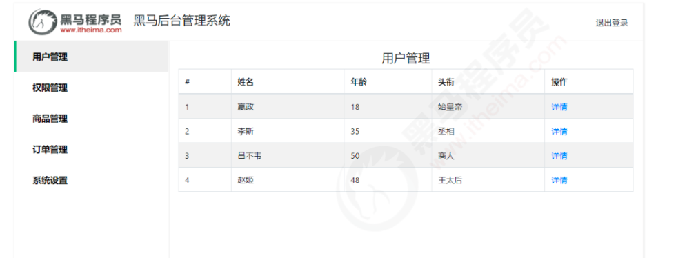

步骤：

1. 安装router并且新建router文件夹及index.js文件
2. 在index.js进行初始化
3. 在main.js引入router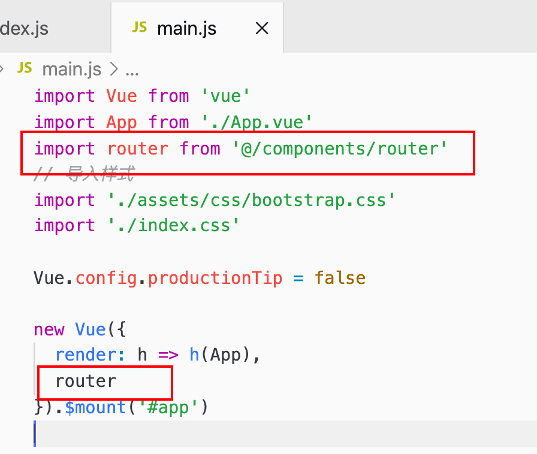
4. 现存Login使其与路由建立关系：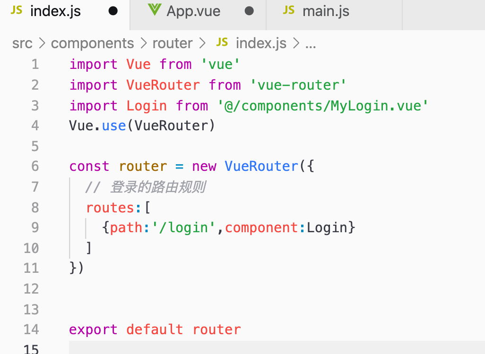
5. 在根组件放占位符使其显示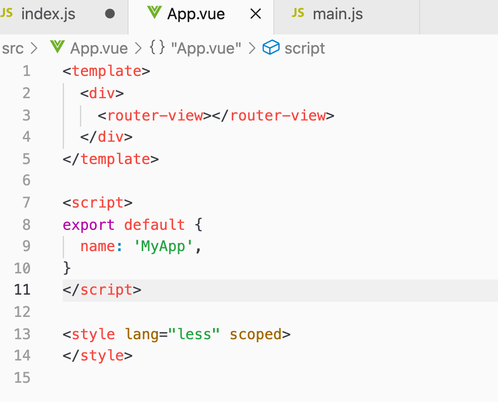
6. 如何一登录便展示该页面：重定向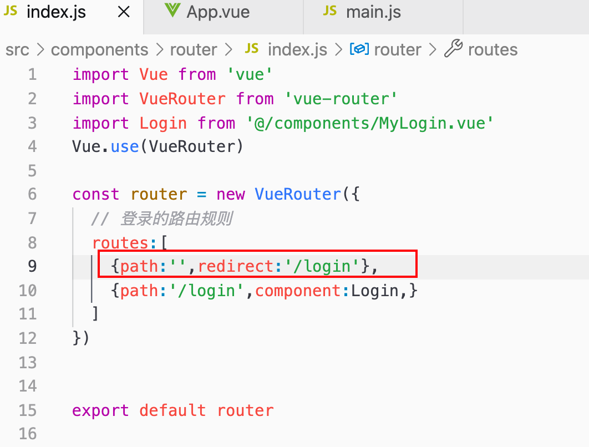
7. 登录页绑定用户名和密码、重置按钮、登录点击函数等等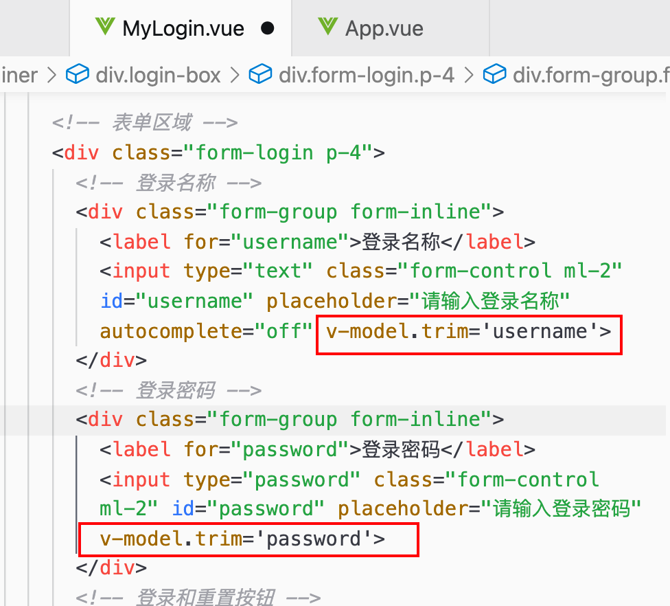
8. token存储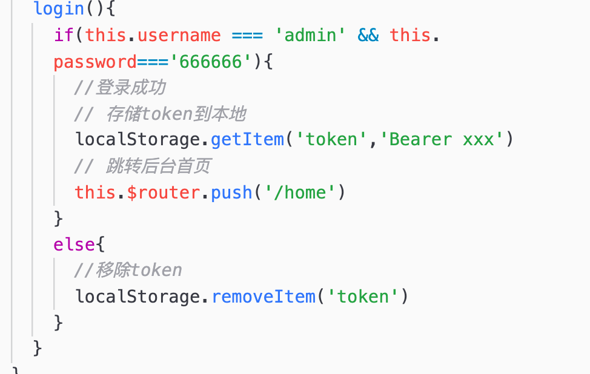
9. 展示Myhome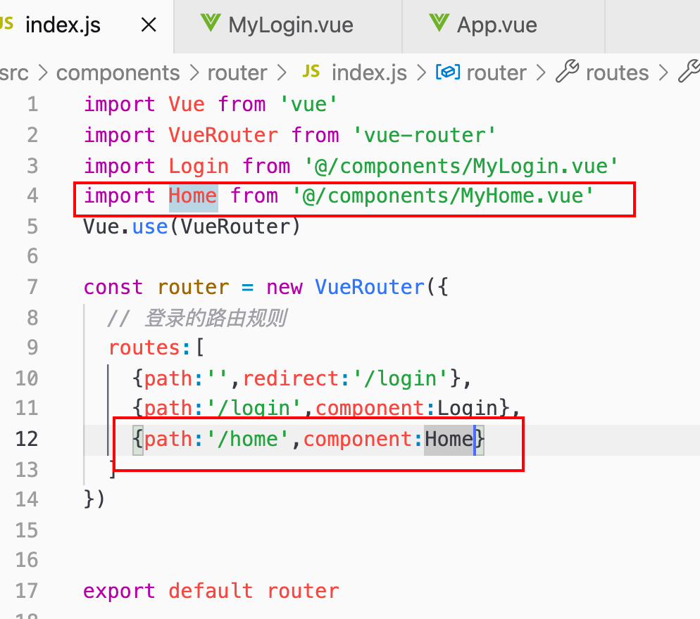
10. 渲染home页面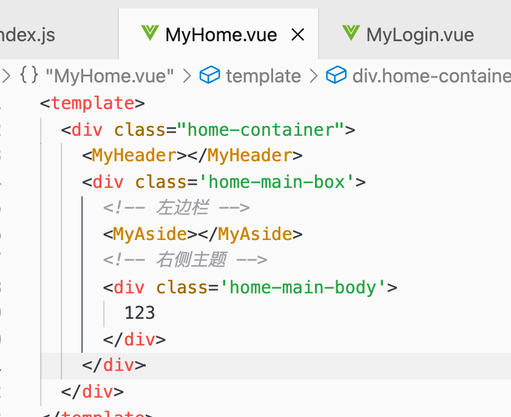
11. 退出登录操作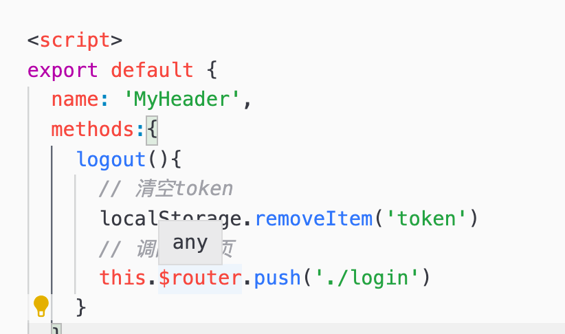
12. 进入home必须先登陆：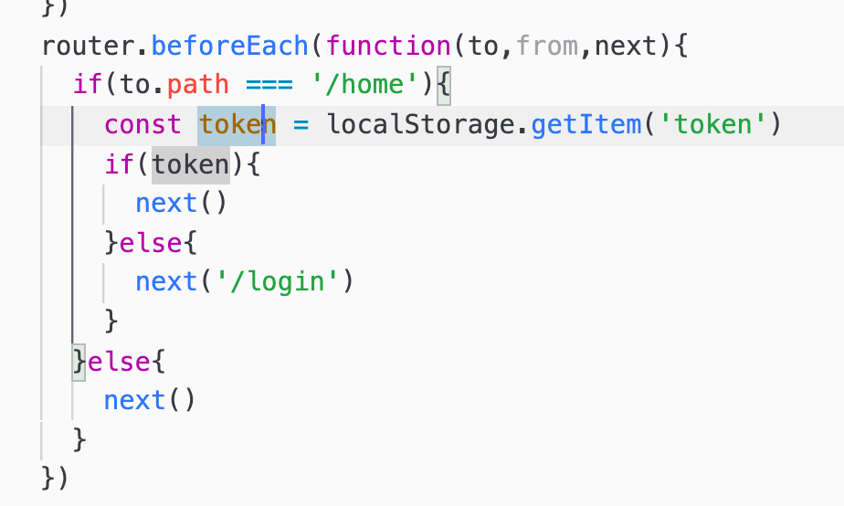
13. 

